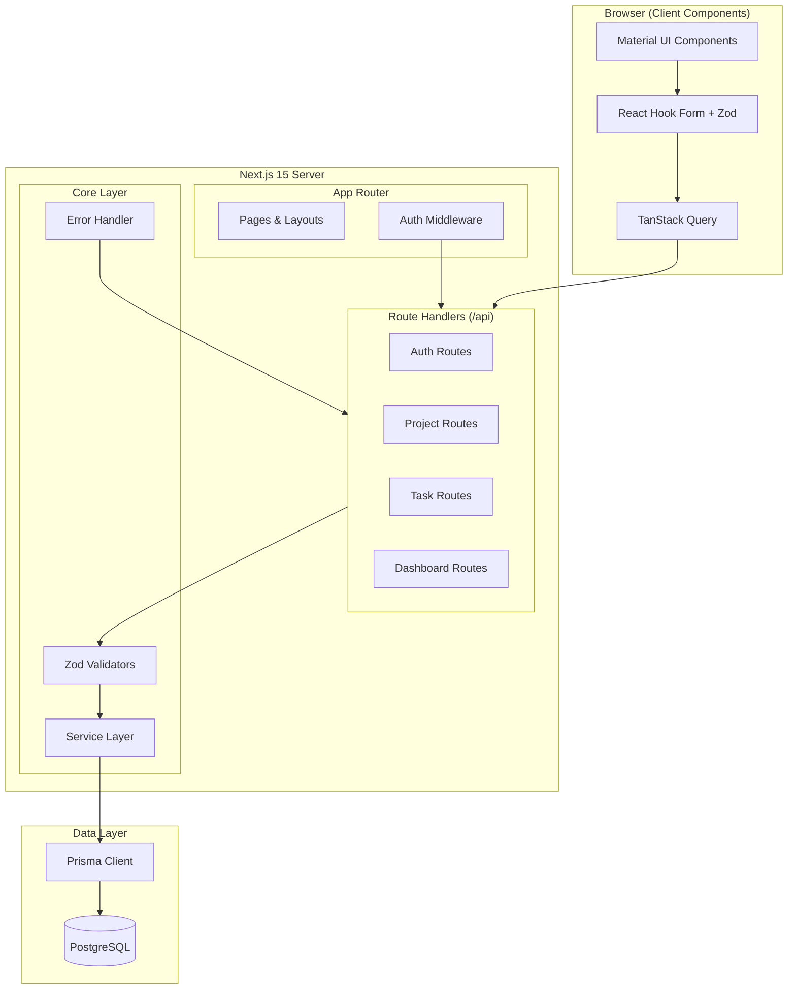

# Design Document: Project Tracker

## Overview

Project Tracker is a full-stack Next.js 15 application that enables authenticated users to manage projects and tasks from a centralized dashboard. The system follows a traditional client-server architecture using Next.js App Router for both the frontend (React Server Components + Client Components) and backend (Route Handlers as REST API). PostgreSQL with Prisma ORM handles persistence, Auth.js with JWT strategy manages authentication, and Material UI provides the component library.

Key design decisions:

- **Next.js App Router** chosen for co-located frontend/backend, server components for initial page loads, and built-in middleware for route protection
- **JWT-based sessions** (via Auth.js) for stateless authentication that scales without session storage
- **Prisma ORM** for type-safe database access, migrations, and seeding
- **Zod** for runtime validation shared between client forms (React Hook Form) and API route handlers
- **TanStack Query** for client-side caching, background refetching, and optimistic UI patterns

## Architecture



### Request Flow

1. Client submits form data validated by Zod (client-side)
2. TanStack Query sends request to API route handler
3. Next.js middleware checks JWT token validity for protected routes
4. Route handler validates request body with Zod (server-side)
5. Service layer executes business logic via Prisma
6. Response returns through the chain with consistent JSON structure

### Directory Structure

```
src/
├── app/
│   ├── (auth)/
│   │   ├── login/page.tsx
│   │   └── register/page.tsx
│   ├── (protected)/
│   │   ├── layout.tsx              # Sidebar + auth check
│   │   ├── dashboard/page.tsx
│   │   ├── projects/
│   │   │   ├── page.tsx            # List view
│   │   │   └── [id]/page.tsx       # Detail/edit view
│   │   └── tasks/page.tsx          # Global task list
│   ├── api/
│   │   ├── auth/
│   │   │   ├── register/route.ts
│   │   │   ├── login/route.ts
│   │   │   └── logout/route.ts
│   │   ├── dashboard/route.ts
│   │   ├── projects/
│   │   │   ├── route.ts            # GET (list), POST (create)
│   │   │   └── [id]/
│   │   │       ├── route.ts        # GET, PUT, DELETE
│   │   │       └── tasks/route.ts  # GET, POST (project tasks)
│   │   └── tasks/
│   │       ├── route.ts            # GET (global list)
│   │       └── [id]/route.ts       # GET, PUT, DELETE
│   ├── not-found.tsx
│   └── layout.tsx
├── components/
│   ├── ui/                         # Shared UI components
│   ├── forms/                      # Form components
│   ├── dashboard/                  # Dashboard widgets
│   ├── projects/                   # Project-specific components
│   └── tasks/                      # Task-specific components
├── lib/
│   ├── auth.ts                     # Auth.js config
│   ├── prisma.ts                   # Prisma client singleton
│   ├── api-client.ts               # Fetch wrapper with error handling
│   └── utils.ts                    # Shared utilities
├── services/
│   ├── auth.service.ts
│   ├── project.service.ts
│   ├── task.service.ts
│   └── dashboard.service.ts
├── validators/
│   ├── auth.schema.ts
│   ├── project.schema.ts
│   └── task.schema.ts
├── types/
│   └── index.ts                    # Shared TypeScript types
├── hooks/
│   ├── useProjects.ts
│   ├── useTasks.ts
│   └── useDashboard.ts
└── middleware.ts                    # Route protection
```

## Components and Interfaces

### API Endpoints

| Method | Endpoint                 | Description                                 | Auth |
| ------ | ------------------------ | ------------------------------------------- | ---- |
| POST   | /api/auth/register       | Register new user                           | No   |
| POST   | /api/auth/login          | Authenticate user                           | No   |
| POST   | /api/auth/logout         | Invalidate session                          | Yes  |
| GET    | /api/dashboard           | Get dashboard stats                         | Yes  |
| GET    | /api/projects            | List projects (paginated, filterable)       | Yes  |
| POST   | /api/projects            | Create project                              | Yes  |
| GET    | /api/projects/[id]       | Get project with tasks                      | Yes  |
| PUT    | /api/projects/[id]       | Update project                              | Yes  |
| DELETE | /api/projects/[id]       | Delete project + tasks                      | Yes  |
| GET    | /api/projects/[id]/tasks | List tasks for project                      | Yes  |
| POST   | /api/projects/[id]/tasks | Create task in project                      | Yes  |
| GET    | /api/tasks               | List all user tasks (paginated, filterable) | Yes  |
| GET    | /api/tasks/[id]          | Get task                                    | Yes  |
| PUT    | /api/tasks/[id]          | Update task                                 | Yes  |
| DELETE | /api/tasks/[id]          | Delete task                                 | Yes  |

### API Response Format

All API responses follow a consistent envelope:

```typescript
// Success response
interface ApiSuccessResponse<T> {
  success: true;
  data?: T;
  message?: string;
}

// Error response
interface ApiErrorResponse {
  success: false;
  message: string;
  errors?: FieldError[]; // For validation errors
}

interface FieldError {
  field: string;
  message: string;
}

// Paginated response
interface PaginatedResponse<T> {
  success: true;
  data: T[];
  pagination: {
    total: number;
    page: number;
    pageSize: number;
    totalPages: number;
  };
}
```

### Service Layer Interface

```typescript
// auth.service.ts
interface AuthService {
  register(
    data: RegisterInput,
  ): Promise<{ id: string; name: string; email: string }>;
  login(data: LoginInput): Promise<{ token: string; user: UserInfo }>;
  logout(token: string): Promise<void>;
  validateSession(token: string): Promise<UserInfo | null>;
}

// project.service.ts
interface ProjectService {
  create(data: CreateProjectInput, userId: string): Promise<Project>;
  findById(id: string, userId: string): Promise<ProjectWithTasks | null>;
  findAll(
    params: ProjectListParams,
    userId: string,
  ): Promise<PaginatedResult<Project>>;
  update(
    id: string,
    data: UpdateProjectInput,
    userId: string,
  ): Promise<Project | null>;
  delete(id: string, userId: string): Promise<boolean>;
}

// task.service.ts
interface TaskService {
  create(data: CreateTaskInput, userId: string): Promise<Task>;
  findById(id: string, userId: string): Promise<Task | null>;
  findAll(
    params: TaskListParams,
    userId: string,
  ): Promise<PaginatedResult<Task>>;
  findByProject(projectId: string, userId: string): Promise<Task[]>;
  update(
    id: string,
    data: UpdateTaskInput,
    userId: string,
  ): Promise<Task | null>;
  delete(id: string, userId: string): Promise<boolean>;
}

// dashboard.service.ts
interface DashboardService {
  getStats(userId: string): Promise<DashboardStats>;
  getRecentProjects(userId: string, limit: number): Promise<Project[]>;
  getRecentTasks(userId: string, limit: number): Promise<Task[]>;
}
```

### Frontend Components

```typescript
// Dashboard
<DashboardPage>
  <StatsGrid>               // 6 stat cards in responsive grid
    <StatCard />            // Individual metric card
  </StatsGrid>
  <RecentProjectsTable />   // 5 most recent projects
  <RecentTasksList />       // 5 most recent tasks
</DashboardPage>

// Projects
<ProjectListPage>
  <SearchBar />             // Search + filter controls
  <ViewToggle />            // Table/Grid toggle
  <ProjectTable />          // Table view
  <ProjectGrid />           // Card grid view
  <Pagination />            // Page controls
</ProjectListPage>

<ProjectDetailPage>
  <ProjectHeader />         // Name, status badge, actions
  <ProjectForm />           // Edit form (React Hook Form)
  <TaskList />              // Tasks within project
  <CreateTaskDialog />      // Modal for new task
</ProjectDetailPage>

// Tasks
<TaskListPage>
  <SearchBar />             // Search + filter controls
  <TaskCardGrid />          // Card-based task display
  <Pagination />
</TaskListPage>

// Auth
<LoginPage>
  <LoginForm />             // Email + password form
</LoginPage>

<RegisterPage>
  <RegisterForm />          // Name + email + password form
</RegisterPage>

// Layout
<ProtectedLayout>
  <Sidebar />               // Navigation (collapsible on mobile)
  <TopBar />                // User info + logout
  <MainContent />           // Page content area
</ProtectedLayout>
```

### Middleware

```typescript
// middleware.ts
// Intercepts requests to protected routes
// Checks for valid JWT in cookies/headers
// Redirects unauthenticated users to /login?callbackUrl=<original>
// Allows /login, /register, /api/auth/* without auth
```

## Data Models

### Prisma Schema

```prisma
generator client {
  provider = "prisma-client-js"
}

datasource db {
  provider = "postgresql"
  url      = env("DATABASE_URL")
}

enum ProjectStatus {
  Planned
  Active
  Completed
}

enum TaskStatus {
  Todo
  InProgress
  Done
}

enum Priority {
  Low
  Medium
  High
}

model User {
  id        String    @id @default(uuid())
  name      String    @db.VarChar(100)
  email     String    @unique @db.VarChar(255)
  password  String    // bcrypt hash
  createdAt DateTime  @default(now())
  updatedAt DateTime  @updatedAt
  projects  Project[]

  @@map("users")
}

model Project {
  id          String        @id @default(uuid())
  name        String        @db.VarChar(255)
  description String        @default("") @db.Text
  status      ProjectStatus @default(Planned)
  priority    Priority
  startDate   DateTime?
  endDate     DateTime?
  progress    Int           @default(0) // 0-100
  ownerId     String
  owner       User          @relation(fields: [ownerId], references: [id], onDelete: Cascade)
  tasks       Task[]
  createdAt   DateTime      @default(now())
  updatedAt   DateTime      @updatedAt

  @@index([ownerId])
  @@index([status])
  @@index([name])
  @@map("projects")
}

model Task {
  id          String     @id @default(uuid())
  title       String     @db.VarChar(255)
  description String     @default("") @db.Text
  status      TaskStatus @default(Todo)
  priority    Priority
  dueDate     DateTime?
  projectId   String
  project     Project    @relation(fields: [projectId], references: [id], onDelete: Cascade)
  createdAt   DateTime   @default(now())
  updatedAt   DateTime   @updatedAt

  @@index([projectId])
  @@index([status])
  @@map("tasks")
}
```

### Zod Validation Schemas

```typescript
// validators/auth.schema.ts
const registerSchema = z.object({
  name: z.string().min(1).max(100).transform(sanitize),
  email: z.string().email().max(255).transform(sanitize),
  password: z.string().min(8).max(128),
});

const loginSchema = z.object({
  email: z.string().email(),
  password: z.string().min(8),
});

// validators/project.schema.ts
const createProjectSchema = z
  .object({
    name: z.string().min(1).max(255).transform(sanitize),
    description: z
      .string()
      .max(5000)
      .optional()
      .default("")
      .transform(sanitize),
    status: z.nativeEnum(ProjectStatus).optional().default("Planned"),
    priority: z.nativeEnum(Priority),
    startDate: z.string().datetime().optional().nullable(),
    endDate: z.string().datetime().optional().nullable(),
    progress: z.number().int().min(0).max(100).optional().default(0),
  })
  .refine(
    (data) => {
      if (data.startDate && data.endDate) {
        return new Date(data.endDate) >= new Date(data.startDate);
      }
      return true;
    },
    {
      message: "End date must be equal to or later than start date",
      path: ["endDate"],
    },
  );

const updateProjectSchema = createProjectSchema.partial().omit({
  /* no required fields */
});

const projectListParamsSchema = z.object({
  page: z.coerce.number().int().min(1).optional().default(1),
  pageSize: z.coerce.number().int().min(1).max(50).optional().default(10),
  search: z.string().optional(),
  status: z.nativeEnum(ProjectStatus).optional(),
});

// validators/task.schema.ts
const createTaskSchema = z.object({
  title: z.string().min(1).max(255).transform(sanitize),
  description: z.string().max(1024).optional().default("").transform(sanitize),
  status: z.nativeEnum(TaskStatus),
  priority: z.nativeEnum(Priority),
  dueDate: z.string().datetime().optional().nullable(),
  projectId: z.string().uuid(),
});

const updateTaskSchema = createTaskSchema.partial().omit({ projectId: true });

const taskListParamsSchema = z.object({
  page: z.coerce.number().int().min(1).optional().default(1),
  pageSize: z.coerce.number().int().min(1).max(50).optional().default(10),
  search: z.string().optional(),
  status: z.nativeEnum(TaskStatus).optional(),
  priority: z.nativeEnum(Priority).optional(),
});

// Sanitization utility
function sanitize(value: string): string {
  return value.trim().replace(/<[^>]*>/g, "");
}
```

## Correctness Properties

_A property is a characteristic or behavior that should hold true across all valid executions of a system — essentially, a formal statement about what the system should do. Properties serve as the bridge between human-readable specifications and machine-verifiable correctness guarantees._

### Property 1: Registration produces valid user with hashed password

_For any_ valid registration input (name 1-100 chars, valid email, password 8-128 chars), the auth service SHALL create a user record with a UUID identifier, the provided name, the provided email, and a password field that is a bcrypt hash (not equal to plaintext input and matching bcrypt format).

**Validates: Requirements 1.1, 1.4**

### Property 2: Invalid input rejection with field-level errors

_For any_ request body that violates its endpoint's Zod schema (e.g., missing required fields, values outside allowed ranges, invalid enum values, malformed email), the validator SHALL return a 400 status code with a structured response containing at least one field-level error specifying the field path and failure reason.

**Validates: Requirements 1.3, 2.3, 6.3, 6.4, 8.5, 10.4, 10.5, 11.4, 12.2, 13.1, 13.2**

### Property 3: Login round trip

_For any_ registered user with known credentials, submitting those exact credentials to the login endpoint SHALL return a 200 status code with a session token that has a 24-hour expiry.

**Validates: Requirements 2.1**

### Property 4: Logout idempotence

_For any_ authenticated session, calling logout N times (where N ≥ 1) SHALL return a 200 status code for every request, and the session SHALL be invalid after the first call.

**Validates: Requirements 3.1, 3.4**

### Property 5: Route protection for unauthenticated requests

_For any_ protected API endpoint, a request without a valid session token SHALL receive a 401 status code. _For any_ protected page path, an unauthenticated navigation SHALL redirect to /login with the original URL preserved as a callback parameter.

**Validates: Requirements 4.1, 4.2**

### Property 6: Dashboard count accuracy

_For any_ set of projects and tasks owned by a user, the dashboard counts SHALL equal: totalProjects = count(all projects), activeProjects = count(projects where status = Active), completedProjects = count(projects where status = Completed), totalTasks = count(all tasks), pendingTasks = count(tasks where status ∈ {Todo, InProgress}), completedTasks = count(tasks where status = Done).

**Validates: Requirements 5.1**

### Property 7: Dashboard recent items ordering

_For any_ set of projects (or tasks) owned by a user, the dashboard "recent" list SHALL contain at most 5 items, all items SHALL be from the user's data, and they SHALL be ordered by updatedAt descending (i.e., for each consecutive pair, the earlier item has an updatedAt ≥ the later item's updatedAt).

**Validates: Requirements 5.2, 5.3**

### Property 8: Project creation applies defaults correctly

_For any_ valid project creation input, the created project SHALL have: a UUID id, the provided name and priority, description defaulting to "" if omitted, status defaulting to "Planned" if omitted, progress defaulting to 0 if omitted, and the authenticated user's ID as ownerId.

**Validates: Requirements 6.1, 6.2**

### Property 9: Date constraint enforcement

_For any_ project creation or update payload that provides both a startDate and an endDate where endDate < startDate, the validator SHALL reject the request with a 400 status code. Conversely, _for any_ payload where endDate ≥ startDate, the date constraint SHALL pass validation.

**Validates: Requirements 6.5**

### Property 10: Pagination metadata correctness

_For any_ total item count T, requested page P, and pageSize S (where 1 ≤ S ≤ 50), the response metadata SHALL satisfy: totalPages = ⌈T/S⌉, page = P, pageSize = S, total = T, and the returned data array SHALL contain min(S, T - (P-1)\*S) items (or 0 if P > totalPages).

**Validates: Requirements 7.1, 7.5, 11.1**

### Property 11: Project search filters correctly

_For any_ search term Q and set of projects owned by a user, every project in the search results SHALL have a name containing Q (case-insensitive), and no project whose name contains Q SHALL be excluded from results (within the current page).

**Validates: Requirements 7.2**

### Property 12: Task search filters correctly

_For any_ search term Q and set of tasks from user-owned projects, every task in the search results SHALL have a title containing Q (case-insensitive).

**Validates: Requirements 11.2**

### Property 13: Status and priority filter correctness

_For any_ combination of status filter and/or priority filter applied to a listing endpoint, every returned item SHALL match ALL specified filter values (AND logic). No item matching all filters SHALL be excluded from results (within the current page).

**Validates: Requirements 7.4, 11.3**

### Property 14: Ownership isolation

_For any_ project or task owned by user A, when user B (where B ≠ A) attempts to read, update, or delete that resource, the API SHALL return a 404 status code. User B SHALL never receive the resource data.

**Validates: Requirements 8.3, 8.7, 9.3, 10.2, 12.4**

### Property 15: Partial update preserves unchanged fields

_For any_ valid partial update payload containing a subset of updatable fields, after the update completes, the specified fields SHALL equal their new values, and all other fields on the record SHALL remain unchanged from their pre-update values.

**Validates: Requirements 8.4, 12.1**

### Property 16: Cascading delete removes all associated records

_For any_ project with N associated tasks (N ≥ 0), deleting the project SHALL result in the project and all N tasks being removed from the database. After deletion, querying for the project or any of its tasks SHALL return no results.

**Validates: Requirements 9.1, 9.4**

### Property 17: Input sanitization

_For any_ string input, the sanitize function SHALL: (a) remove all leading and trailing whitespace, and (b) remove all HTML tags (content matching `<[^>]*>`). The resulting string SHALL contain no HTML tag patterns and no leading/trailing whitespace.

**Validates: Requirements 13.3**

### Property 18: Error response format consistency

_For any_ API error response (4xx or 5xx), the response SHALL have Content-Type `application/json` and body matching `{ success: false, message: string }`. Additionally, _for any_ 500 response, the message SHALL NOT contain file paths, stack traces, database query text, or internal variable names.

**Validates: Requirements 14.1, 14.2**

### Property 19: Seed script idempotence

_For any_ number of consecutive seed script executions N (N ≥ 1), the database SHALL contain exactly 1 user, 10 projects, and 50 tasks after completion — never more, regardless of N.

**Validates: Requirements 18.3**

## Error Handling

### API Error Strategy

All API errors are handled through a centralized error handler utility:

```typescript
// lib/error-handler.ts
type AppError = {
  statusCode: number;
  message: string;
  errors?: FieldError[];
};

function handleApiError(error: unknown): NextResponse {
  // Zod validation errors → 400 with field-level details
  if (error instanceof ZodError) {
    return NextResponse.json(
      {
        success: false,
        message: "Validation failed",
        errors: error.errors.map((e) => ({
          field: e.path.join("."),
          message: e.message,
        })),
      },
      { status: 400 },
    );
  }

  // Known application errors (custom AppError class)
  if (error instanceof AppError) {
    return NextResponse.json(
      {
        success: false,
        message: error.message,
      },
      { status: error.statusCode },
    );
  }

  // Prisma known errors (e.g., unique constraint violation)
  if (error instanceof Prisma.PrismaClientKnownRequestError) {
    if (error.code === "P2002") {
      return NextResponse.json(
        {
          success: false,
          message: "A record with this value already exists",
        },
        { status: 400 },
      );
    }
  }

  // Unknown/unexpected errors → 500 with generic message
  console.error("Unexpected error:", error);
  return NextResponse.json(
    {
      success: false,
      message: "An unexpected error occurred",
    },
    { status: 500 },
  );
}
```

### Client-Side Error Handling

```typescript
// TanStack Query global error handler
const queryClient = new QueryClient({
  defaultOptions: {
    queries: {
      retry: 1,
      staleTime: 30_000, // 30 seconds
    },
    mutations: {
      onError: (error: ApiError) => {
        toast.error(error.message, { duration: 5000 });
      },
    },
  },
});

// API client with timeout and error normalization
async function apiClient<T>(url: string, options?: RequestInit): Promise<T> {
  const controller = new AbortController();
  const timeout = setTimeout(() => controller.abort(), 10_000);

  try {
    const response = await fetch(url, {
      ...options,
      signal: controller.signal,
    });
    clearTimeout(timeout);

    if (!response.ok) {
      const body = await response.json();
      throw new ApiError(body.message, response.status, body.errors);
    }

    return response.json();
  } catch (error) {
    clearTimeout(timeout);
    if (error instanceof DOMException && error.name === "AbortError") {
      throw new ApiError("Server is unreachable. Please try again.", 0);
    }
    throw error;
  }
}
```

### Error Categories

| Status Code | Trigger                         | User-Facing Message                        |
| ----------- | ------------------------------- | ------------------------------------------ |
| 400         | Zod validation failure          | Field-specific error messages              |
| 400         | Malformed/missing JSON body     | "Request body is missing or malformed"     |
| 401         | Missing/invalid/expired token   | "Please log in to continue"                |
| 404         | Resource not found or not owned | "The requested resource was not found"     |
| 500         | Unexpected server error         | "An unexpected error occurred"             |
| 0 (timeout) | 10s request timeout             | "Server is unreachable. Please try again." |

## Testing Strategy

### Testing Stack

- **Unit Tests**: Vitest (fast, TypeScript-native, compatible with Next.js)
- **Property-Based Tests**: fast-check (with Vitest as the runner)
- **Integration Tests**: Vitest + Prisma (with test database)
- **Component Tests**: Vitest + React Testing Library
- **E2E Tests**: Playwright (optional, for critical user flows)

### Property-Based Testing Configuration

Each property test uses fast-check with minimum 100 iterations:

```typescript
import { fc } from "@fast-check/vitest";
import { test } from "vitest";

// Feature: project-tracker, Property 17: Input sanitization
test.prop([fc.string()], { numRuns: 100 })(
  "sanitized string has no HTML tags or surrounding whitespace",
  (input) => {
    const result = sanitize(input);
    expect(result).toBe(result.trim());
    expect(result).not.toMatch(/<[^>]*>/);
  },
);
```

### Test Organization

```
tests/
├── unit/
│   ├── validators/           # Zod schema tests
│   │   ├── auth.schema.test.ts
│   │   ├── project.schema.test.ts
│   │   └── task.schema.test.ts
│   ├── services/             # Service logic tests (mocked Prisma)
│   │   ├── auth.service.test.ts
│   │   ├── project.service.test.ts
│   │   ├── task.service.test.ts
│   │   └── dashboard.service.test.ts
│   └── utils/
│       ├── sanitize.test.ts
│       └── pagination.test.ts
├── properties/               # Property-based tests
│   ├── validation.property.test.ts
│   ├── sanitization.property.test.ts
│   ├── pagination.property.test.ts
│   ├── ownership.property.test.ts
│   ├── dashboard.property.test.ts
│   ├── search-filter.property.test.ts
│   ├── partial-update.property.test.ts
│   └── date-constraint.property.test.ts
├── integration/              # Tests with real database
│   ├── auth.integration.test.ts
│   ├── projects.integration.test.ts
│   ├── tasks.integration.test.ts
│   └── seed.integration.test.ts
└── components/               # React component tests
    ├── dashboard/
    ├── projects/
    └── tasks/
```

### Test Coverage Goals

| Layer              | Tool                  | Focus                                                    |
| ------------------ | --------------------- | -------------------------------------------------------- |
| Validation schemas | fast-check + Vitest   | Properties 2, 9, 17                                      |
| Service layer      | fast-check + Vitest   | Properties 6, 7, 8, 10, 11, 12, 13, 14, 15, 16           |
| Auth service       | fast-check + Vitest   | Properties 1, 3, 4, 5                                    |
| Error handling     | Vitest                | Property 18                                              |
| Seed script        | Vitest                | Property 19                                              |
| UI components      | React Testing Library | Example-based (responsiveness, toasts, skeleton loaders) |
| E2E flows          | Playwright            | Login → Create project → Add tasks → Dashboard           |

### Unit Tests (Example-Based)

Unit tests complement property tests by covering:

- Specific error scenarios (duplicate email, non-existent resources)
- UI component rendering (404 page content, toast appearance, responsive layouts)
- Configuration verification (TanStack Query stale time, API timeout)
- Integration points (middleware redirect behavior, callback URL preservation)

### Key Testing Principles

1. **Property tests validate universal correctness** — validation logic, business rules, data invariants
2. **Unit tests validate specific examples** — error paths, UI states, edge cases
3. **Integration tests verify wiring** — database operations, seeding, transaction behavior
4. **Each property test references its design property** with a tag comment:
   ```
   // Feature: project-tracker, Property {N}: {title}
   ```
5. **Minimum 100 iterations** per property-based test due to input randomization
6. **Service tests use mocked Prisma** for speed; integration tests use a real test database
